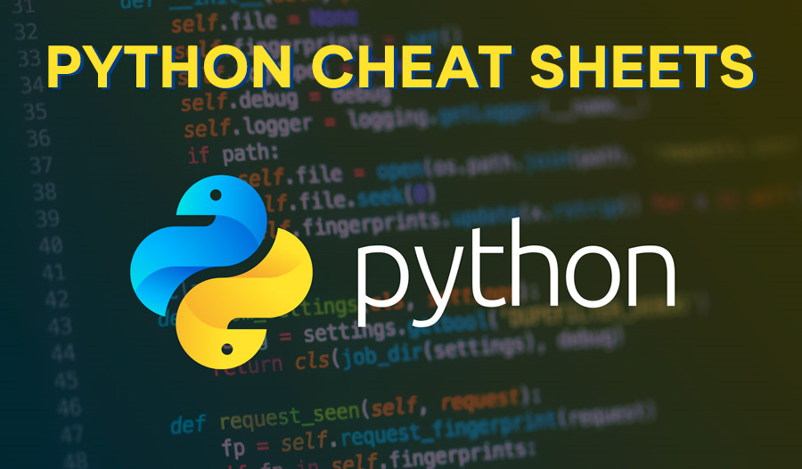

  
  

Wellcome to my Cheat Sheet page, this is work in progress to assist me and any others who may find it useful.

# Table of Contents

- [Data Types](pages/data.md#data-types)
- [Data Structures](pages/data.md#data-structures)
  - [Lists](pages/data.md#lists)
    - [List Items](pages/data.md#list-items)
    - [Changing the values of a List](pages/data.md#changing-the-values-of-a-list)
    - [Duplicates are Allowed](pages/data.md#duplicates-are-allowed)
    - [Length of List](pages/data.md#length-of-list)
    - [List - Data Types](pages/data.md#list---data-types)
  - [Dictionaries](pages/data.md#dictionaries)
    - [Dictionary Items](pages/data.md#dictionary-items)
  - [Tuples](pages/data.md#tuples)
    - [Tuples with one item](pages/data.md#tuples-items)
    - [Changing the value of a Tuple](pages/data.md#changing-the-values-of-a-tuple)
    - [Concatenating Tuples](pages/data.md#concatenating-tuples)
    - [Reversing Tuples](pages/dataa.md#reversing-tuples)
  - [Sets](/pages/data.md#sets)
- [Operators](pages/operators.md)
  - [Arithmetic Operators](pages/operators.md#arithmetic-operators)
  - [Assignment operators](pages/operators.md#assignment-operators)
  - [Comparison operators](pages/operators.md#comparison-operators)
  - [Logical operators](pages/operators.md#logical-operators)
  - [Identity operators](pages/operators.md#identity-operators)
  - [Membership operators](pages/operators.md#membership-operators)
  - [Bitwise operators](pages/operators.md#bitwise-operators)
- [Loops](pages/loops.md)  
  - [While Loops](pages/loops.md#while-loops)
  - [For Loops](pages/loops.md#for-loops)
  - [The Break Statement](pages/loops.md#the-break-statement)
  - [The Continue Statement](pages/loops.md#the-contine-statement)
  - [The Else Statement](pages/loops.md#the-else-statement)
